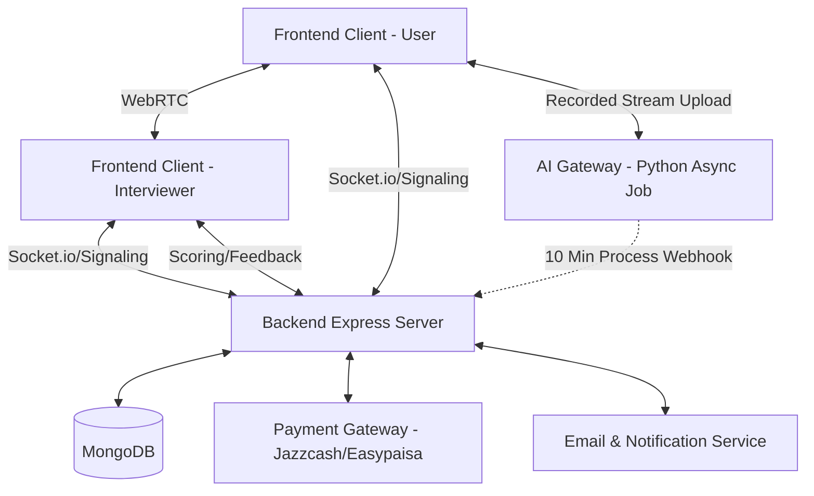

# Premium Live Interview Feature Architecture Documentation

This document outlines the architecture, data models, and implementation steps required to build the **Premium Live Interview Feature** within the existing `AI-Web-Based-Mock-Interview-System`.

## 1. System Architecture Overview

The feature requires integration across the Frontend (Next.js), Backend (Express/MongoDB), and an external WebRTC communication layer.



### Key Components:
1. **WebRTC & Signaling:** Peer-to-peer (P2P) connections for low-latency video and audio, negotiated via WebSockets (Socket.io) on the Express backend.
2. **Scheduling Engine:** A service running on the Express backend that auto-matches the user's selected role and skills to an available interviewer.
3. **Payment Service:** Integration with a payment provider (e.g., Stripe) configured to fire webhooks upon successful payment to confirm the interview slot.
4. **AI Asynchronous Analysis:** Post-interview processing. The recorded streams are passed to the Python AI Gateway, taking approximately 10 minutes to analyze facial expressions, natural language, and voice sentiment. Results trigger notifications and emails.

---

## 2. Database Schema Additions (Mongoose)

### A. Interviewer Profile Model (`models/Interviewer.js`)
```javascript
const mongoose = require('mongoose');

const interviewerSchema = new mongoose.Schema({
  userId: { type: mongoose.Schema.Types.ObjectId, ref: 'User', required: true },
  domains: [{ type: String }], // e.g., "frontend", "backend"
  skills: [{ type: String }], // e.g., "React", "Node.js", "System Design"
  roles: [{ type: String }], // e.g., "Senior Software Engineer"
  hourlyRate: { type: Number, required: true },
  availability: [{
    dayOfWeek: { type: Number }, // 0-6
    startTime: { type: String }, // "09:00"
    endTime: { type: String }    // "17:00"
  }],
  rating: { type: Number, default: 0 },
});

module.exports = mongoose.model('Interviewer', interviewerSchema);
```

### B. Live Session Booking Model (`models/LiveBooking.js`)
```javascript
const mongoose = require('mongoose');

const liveBookingSchema = new mongoose.Schema({
  applicantId: { type: mongoose.Schema.Types.ObjectId, ref: 'User', required: true },
  interviewerId: { type: mongoose.Schema.Types.ObjectId, ref: 'Interviewer', required: true }, // Auto-assigned by system
  role: { type: String, required: true },
  skills: [{ type: String }],
  domain: { type: String, required: true },
  scheduledTime: { type: Date, required: true },
  status: { 
    type: String, 
    enum: ['pending_payment', 'confirmed', 'completed', 'evaluating_ai', 'results_ready'],
    default: 'pending_payment'
  },
  paymentId: { type: String }, // ID from Payment Gateway
  meetingRoomId: { type: String, unique: true }, // For routing to the correct WebRTC room
  aiReport: { type: mongoose.Schema.Types.Mixed },
  humanScore: { type: Number },
  humanFeedback: { type: String }
});

module.exports = mongoose.model('LiveBooking', liveBookingSchema);
```

---

## 3. Implementation Plan & Workflows

### Step 1: Automated Scheduling Flow (Backend API & Matching)
1. **POST `/api/bookings/request`**: 
   - User submits desired `role`, `skills`, `domain`, and preferred `scheduledTime`.
   - **Auto-Matching Logic**: The system queries the `Interviewer` collection for a match that supports the requested role/skills and has availability corresponding to the requested time.
   - Creates a `LiveBooking` with status `pending_payment` linked to the matched interviewer.
   - Automatically directs user to the checkout page.

### Step 2: Payment Gateway Integration
1. **POST `/api/payments/create-checkout`**:
   - Generates a Jazzcash/Easypaisa Checkout Session for the `LiveBooking`.
2. **POST `/api/webhooks/jazzcash`**:
   - Listens for `checkout.session.completed` hook.
   - Updates `LiveBooking` status to `confirmed`.
   - Generates Google Calendar/ICS files and emails final "Add to Calendar" invites to both the applicant and the newly assigned interviewer.
   - Generates a unique secure `meetingRoomId`.

### Step 3: In-App WebRTC Meeting Room (Frontend Next.js Component)
*   **Signaling Server Modification (`server.js`)**: Add `socket.io` to Express. Create events: `join-room`, `offer`, `answer`, `ice-candidate`, `leave-room`.
*   **WebRTC Client (`components/LiveInterviewRoom.tsx`)**:
    *   Requests hardware permissions (Camera/Mic).
    *   Initializes `RTCPeerConnection`.
    *   Auto-records the user's video using the `MediaRecorder` API to prepare for post-interview upload.

### Step 4: Asynchronous AI Analysis Pipeline (~10 Minutes)
*   **Video Upload**: Upon meeting completion, the user's recorded session (either uploaded in chunks during the meeting or immediately after) is finalized and pushed to cloud storage (e.g., S3).
*   **Queueing the Job**: The Express backend sends an event or payload to the Python AI Gateway `/api/ai/analyze-video` with the S3 URL. The `LiveBooking` status updates to `evaluating_ai`.
*   **Python AI Gateway**: Unpacks the video and runs intensive Natural Language Processing, Voice Sentiment Analysis, and Micro-expression Analysis. This async job safely processes for 10 minutes.
*   **Webhook Return**: The Python backend hits an Express endpoint `POST /api/webhooks/ai-analysis-complete` bearing the final AI metrics.

### Step 5: Final Scoring & Notifications
*   **Merging Human Score**: The Interviewer submits their manual score (`humanScore`) and text feedback (`humanFeedback`).
*   **Result Consolidation**: The backend receives the AI Webhook, updates the `aiReport`, merges it with the human feedback, and changes status to `results_ready`.
*   **User Notification**: 
   - The backend fires an in-app notification to the applicant.
   - The `EmailService` dispatches a rich HTML email summarizing the final score, key improvement areas, and a link to view the detailed 360° AI report on their dashboard.

---

## 4. Key Considerations & Risks
*   **Processing Time Validation**: Ensure the Async task runner configured for Python (e.g., Celery or RQ) has extended timeouts (at least 15 mins) configured for video analysis loops. 
*   **Interviewer Matching Weighting**: If multiple interviewers match the `role` and `skills`, add routing logic like round-robin or highest-rating-first to distribute workloads evenly.
*   **Video Retention**: Securely delete user video blobs from S3 after the AI analysis completes to maintain strict data privacy compliance unless the user explicitly opts in for long-term retention.
*   **Feedback Lock**: Ensure the user does not receive the "Result Ready" email until **both** the AI analysis is done and the Interviewer has submitted their manual feedback.

---

## 5. Edge Case Handling & Reliability (Smooth Running Guarantee)

### 1. AI Analysis Processing Failure
*   If the AI Gateway fails to return a result within 20 minutes:
    - Retries the queue job with a backoff strategy.
    - If it definitively fails, the system bypasses AI blocks and notifies the user of purely manual results, while sending an internal slack/monitoring alert to the engineering team.

### 2. Interviewer No-Show & Auto-Refund
*   If the system-assigned Interviewer does not join the `meetingRoomId` within 10 minutes of the slot:
    1. Update status to `failed_no_show`.
    2. Auto-refund via jazzcash/easypaisa.
    3. Apologize via email and offer priority rebooking with a new paired interviewer.

### 3. Interviewer Matching Failure
*   If a user requests a time/role combination that has zero matching interviewers available:
    - Prompt the user directly in the UI to select a different date/time, or expand their skill constraints.

### 4. Offline Fallback for Video Upload
*   If the user's connection crashes exactly at meeting completion, the recorded chunks are cached locally in `IndexedDB`. When the system reconnects (even hours later), Next.js gracefully uploads the cached payload and triggers the 10-minute AI pipeline.
