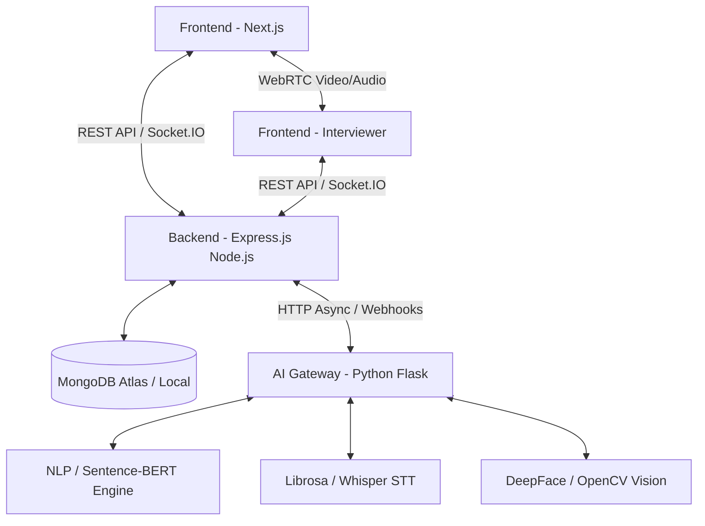

# Intervexa — AI Powered Mock Interview System

**Intervexa** is a state-of-the-art, AI-powered and human-led mock interview platform designed to help job seekers practice, evaluate, and master technical and behavioral interviews.

---

## 🌟 Key Features

### 🤖 1. AI Automated Mock Interviews
- **Adaptive Question Generation**: Dynamic question generation tailored to role, domain, and experience level using LLMs (Groq / LLaMA-3 / Gemini).
- **Multi-Modal AI Evaluation**:
  - **NLP Technical Scoring**: Evaluates candidate answers for technical accuracy, problem-solving depth, and relevance using Sentence-Transformers & NLP models.
  - **Vocal Sentiment & Tone Analysis**: Analyzes audio parameters (pitch variability, speaking pace, pauses, confidence scores) powered by Librosa & Wav2Vec2.
  - **Facial Expression Analysis**: Evaluates facial confidence, eye contact, and emotional cues using DeepFace & OpenCV.
  - **Speech-to-Text (STT)**: High-accuracy transcription of oral responses via OpenAI Whisper.

### 🎥 2. Premium Human Live Interviews
- **Real-Time WebRTC Video Rooms**: Peer-to-Peer low-latency video, audio, and screen sharing between candidates and expert interviewers.
- **7-Stage Automated Lifecycle**:
  `pending_approval` → `accepted` → `payment_pending` → `payment_completed` → `meeting_scheduled` → `meeting_started` → `meeting_completed`
- **Interviewer Matching & Scheduling**: Smart auto-matching based on domain expertise, availability, and rating.
- **Payment & Booking Workflow**: Integrated JazzCash / Card payment gateway wrapper with auto-approval & stub modes for testing.
- **Hybrid AI + Human Feedback**: Post-session dashboard combining human interviewer evaluation with asynchronous AI multi-modal reports.

---

## 🏗️ System Architecture



---

## 🛠️ Technology Stack

| Layer | Technology |
|---|---|
| **Frontend** | Next.js, React, TypeScript, Tailwind CSS, Lucide Icons, Socket.IO Client, WebRTC Client |
| **Backend** | Node.js, Express.js, MongoDB (Mongoose), Socket.IO (Signaling), JWT Auth, Nodemailer |
| **AI Gateway** | Python 3, Flask, PyTorch, Sentence-Transformers, Librosa, DeepFace, OpenCV, Whisper |
| **LLM Provider** | Groq API (LLaMA-3) / Google Gemini API |
| **Database** | MongoDB (Local / Atlas Cloud) |

---

## 🚀 Getting Started

### 📋 Prerequisites
- **Node.js**: v18.x or higher
- **Python**: v3.10+ (for AI Gateway)
- **MongoDB**: Local MongoDB Community Edition or MongoDB Atlas Cloud instance

---

### 1️⃣ Backend Setup (`backend/`)

```bash
cd backend
npm install
```

Create a `.env` file in `backend/`:
```env
PORT=5000
NODE_ENV=development
MONGO_URI=mongodb://localhost:27017/ai_interview_system
JWT_SECRET=your-secret-jwt-key
CORS_ORIGIN=http://localhost:3000
AI_SERVICE_URL=http://127.0.0.1:8000
USE_REAL_AI=true
GROQ_API_KEY=your_groq_api_key
```

Start the Backend Server:
```bash
npm run start
```
> Server runs on `http://localhost:5000`. Swagger API docs available at `http://localhost:5000/api-docs`.

---

### 2️⃣ Python AI Gateway Setup (`ai_gateway/`)

```bash
cd ai_gateway
python -m pip install --upgrade pip setuptools wheel
pip install -r requirements.txt
```

Start the AI Microservice:
```bash
python app.py
```
> AI Gateway runs on `http://localhost:8000`.

---

### 3️⃣ Frontend Setup (Root)

```bash
npm install
```

Create a `.env.local` file in the root directory:
```env
NEXT_PUBLIC_API_URL=http://localhost:5000
```

Start the Frontend Server:
```bash
npm run dev
```
> Frontend runs on `http://localhost:3000`.

---

## 🌐 Connecting 2 Laptops over Local Network (Live Interview Testing)

To test the WebRTC Live Interview between two separate devices on the same Wi-Fi network:

1. Obtain the **Host Laptop's IPv4 Address**:
   ```cmd
   ipconfig
   ```
   *(e.g., `192.168.100.30`)*

2. Update `backend/.env`:
   ```env
   CORS_ORIGIN=http://localhost:3000,http://192.168.100.30:3000
   SOCKET_IO_CORS_ORIGIN=http://localhost:3000,http://192.168.100.30:3000
   ```

3. Update `.env.local`:
   ```env
   NEXT_PUBLIC_API_URL=http://192.168.100.30:5000
   ```

4. Open `http://192.168.100.30:3000` on both laptops to initiate a live WebRTC session!

---

## 📝 License

This project is licensed under the MIT License.
